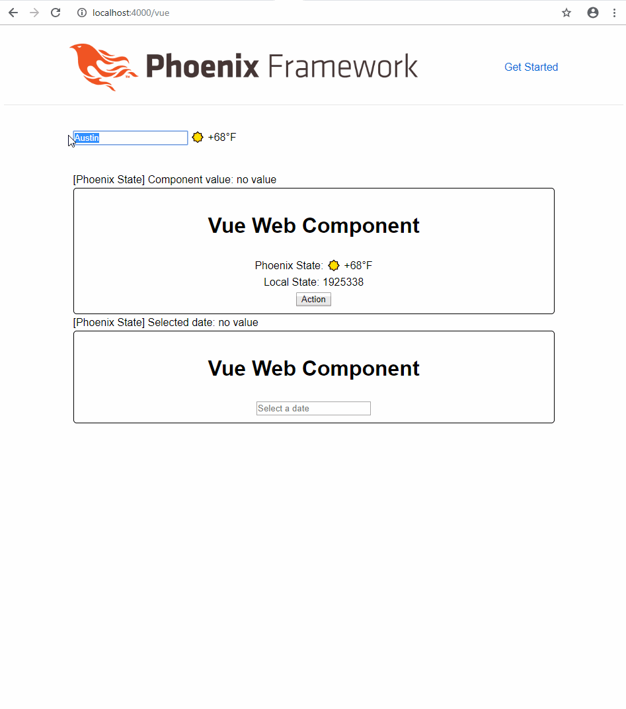

# Live-Vue-Webcomponents
Experimental Vue WebComponents that work with Phoenix Live View



Two prototype components are included. 

`VueWebComponent` demonstrates accepting a state value binding from phoenix (msg) and clicking the button pushes a local state value to the phoenix socket.

`TimePicker` demonstrates a more complex web component, wrapping the flatpickr time chooser widget in a vue wc and pushing the selected date.
 
#### Building Vue components as web components. ####  
```ecmascript 6
npx vue-cli-service build --target wc --name my-web-component ./src/main.js

npx vue-cli-service build --target wc --name time-picker ./src/main-time.js
```

### NOTES ###

Vue must be included in the host page as Vue WebComponents don't include the runtime (to prevent duplicated runtimes with multiple components). See my fork of the phoenix-live examples for necessary changes.

By default the flatpickr binds to `body` which necessitates including the flatpickr style in the host page. This could be avoided by attaching to an element within the shadow dom however the flatpickr wrapper doesnt seem to support that. 

The custom elements have to be deployed along with the phoenix app, I didnt try to optimize delivery. 

As phoenix is listening for click events on the host node, we set the value on the host node, this requires binding to a value prop from phoenix and within the component

e.g. 

```
  def render(assigns) do
    ~L"""
      <my-custom-element msg="<%= @weather %>" phx-click="action" value="<%= @val %>"></my-custom-element>

      <time-picker phx-click="timepicker" value="<%= @selDate %>"></time-picker>
    </div>
    """
  end
``` 

and in vue:

```ecmascript 6
  props: {
    value: {}
  }
```

triggering the value push on the host node:

```ecmascript 6
   async handleClick(event) {
     const host = this.$el.getRootNode().host
     host.setAttribute('value', this.random)
     await this.$nextTick()
     this.$emit('click', event)
   }
```

To block mouse clicks from triggering the wrapper before it's ready to send data:

```ecmascript 6
   async mounted() {
       await this.$nextTick()
       const host = this.$el.getRootNode().host
       host.addEventListener('click', e => {
         e.stopPropagation()
         e.preventDefault()
       }, true)
     },
```

### Why?

I suspect that there are some interactive widgets, especially for interactive forms, where it makes more sense to build that functionality as an encapsulated web component rather than orchestrate that much interactivity from the serverside. But I dont know if that's accurate. For this I just wanted to see if it was possible. 

### Additional note
Much of the complexity in this wrapper is due to the wrapper listening for click events and element.value. If it let you specify custom events e.g. phoenix-custom-myevent="phoenixevent and looked in that event.details for the value payload, then these web components would look much more like normal components e.g. bind to props and $emit custom event payloads without having to suppress clicks, attach to value, or redispatch click events. 


